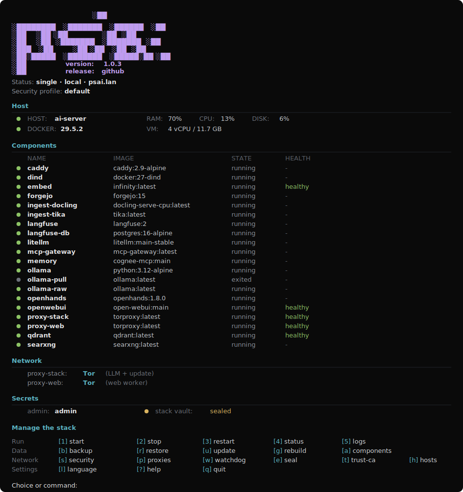

<p align="center">
  
</p>

<h1 align="center">Pandora AI Stack</h1>

<p align="center">
  
  
  
</p>

<p align="center">
  <b>English</b> | <a href="README.ru.md">Русский</a>
</p>

> Stack in development

**Self-hosted AI stack for macOS and Linux with local or public install profiles, Docker runtime, local models, agents, RAG, memory, egress routing, and a hardened secret store.**

<p align="center">
  
</p>

## Components

| Service | Role |
|---|---|
| `openwebui` | Chat UI: cloud and local models, RAG over Qdrant, web search through SearXNG |
| `openhands` | AI agents for autonomous coding and automation; sandbox containers are optional and security-sensitive |
| `searxng` | Private metasearch for chat and agents |
| `forgejo` | Self-hosted git server |
| `qdrant` | Shared vector memory for chat, RAG, and agents |
| `embed` | RAG-plus embeddings on Linux x64 through Infinity; macOS/Linux ARM use Ollama embeddings by default |
| `ingest-docling` / `ingest-tika` | Document ingestion: Docling primary, Tika fallback |
| `mcp` | Built-in MCP memory server over Qdrant |
| `memory` | Cognee or Graphiti shared memory backends |
| `ollama` | Local OpenAI-compatible LLM endpoint for chat and memory |
| `mcp-gateway` | Authenticated Docker MCP Gateway with an explicit tool allowlist |
| `mcpo` | MCP-to-OpenAPI bridge for exposing memory and gateway tools in Open WebUI |
| `litellm` | Optional OpenAI-compatible model gateway with routing, fallback, cache, and budgets |
| `langfuse` | Optional traces, evals, and prompt management |
| `pentest` | Optional isolated PentestGPT container for authorized testing only |
| `caddy` | Reverse proxy and TLS |
| `proxy-stack` | Egress firewall/router for model APIs, local LLM calls, downloads, and updates |
| `proxy-web` | Egress firewall/router for search and agent browsing |
| `stack-vault` | Secret store: local vault on one node, KMS vault in multi-node mode |

When `PSAI_MEMORY=cognee|graphiti` or `PSAI_MCP_GATEWAY=true` is enabled, `mcpo` registers those MCP sources as OpenAPI tool servers in Open WebUI. Chat and agents can then use the same memory and tools. Gateway clients use Bearer tokens stored in `stack-vault`.

## Work Scenarios

### Single Node


One host runs the stack. Open WebUI and agents share one tools and memory layer, Qdrant stores the shared vector state, and outbound traffic goes through the egress proxies.

### Multi Nodes


A master node manages isolated agent worker nodes over WireGuard. A KMS vault can run on the master or on a separate KMS node. Agent workers are reachable only inside WireGuard by default and can have their own OpenHands, SearXNG, and `proxy-web`.

## Quick Start

```bash
bash <(curl -fsSL https://raw.githubusercontent.com/pandora-ai-stack/psai/main/psai.sh)
```

```bash
git clone https://github.com/pandora-ai-stack/psai.git
cd psai && ./psai.sh install
```

## Install

| Step | Description |
|---|---|
| **0 - Environment** | Show Docker and package status; install missing dependencies. |
| **1 - Nodes** | Choose `single` or `multi`. |
| **2 - Profile** | Choose `local` or `public`. |
| **3 - Components** | Enable or disable optional components; the core stack is on by default. |
| **4 - Security** | Choose `strict`, `default`, or `none`; preview and tune individual controls. |
| **5 - Zone and domains** | Keep the default `lan` zone, edit domains, or skip domains on local installs. |

After install, run `psai` to open the dashboard.

```text
Status: single · local · psai.lan
Security profile: default
```

## Egress Proxy

Two egress gateways are available:

- `proxy-stack` routes model APIs, local LLM calls, downloads, and updates.
- `proxy-web` routes search and agent browsing.

Each gateway can use direct egress, Tor, WireGuard, VLESS, AdGuard VPN, or Tailscale. WireGuard mode adds DNS pinning, a kill-switch, optional CIDR allow-lists, and optional FQDN-to-IP allow-listing.


## Security

| Capability | Strict | Default | None |
|---|:--:|:--:|:--:|
| Container hardening (`no-new-privileges`, `cap_drop`) | yes | yes | yes |
| Secrets in `stack-vault` | yes | no | no |
| TPM auto-unseal on Linux | optional | no | no |
| Secrets in plaintext `.env` | no | yes | yes |
| CIS sysctls, sshd hardening, auto-upgrades | yes | yes | no |
| Host firewall | yes | no | no |
| Watchdog | yes | no | no |
| WireGuard-only SSH for multi-node agents | yes | no | no |
| fail2ban on public installs | yes | no | no |

OpenHands can use the host Docker socket (`PSAI_OH_MODE=host`), which is host-level control and not a strong sandbox. Use `PSAI_OH_MODE=dind` on shared or untrusted hosts.

Ollama is exposed through an auth proxy: requests without `Authorization: Bearer ...` get `401`, and raw `ollama-raw:11434` stays on a private Docker network.

Strict mode stores runtime secrets in `stack-vault`. On Linux 5.14+ it uses `memfd_secret`; on older Linux and macOS it falls back to locked memory. KMS, fingerprint binding, TPM, and secret-memory details are documented in [Architecture](docs/ARCHITECTURE.md).


## Dashboard and Commands

```bash
psai install [--defaults]    start | stop | restart | status | logs [svc]
psai update | rebuild        upgrade            (install/remove components)
psai backup | restore        proxy | security   (egress / profile)
psai seal | unseal           watchdog | trust-ca | add-hosts
psai agents --host IP        uninstall          (data is preserved)
psai --lang ru|en            --version | help
```

## Configuration

Common non-interactive overrides:

| Variable | Default | Meaning |
|---|---|---|
| `PSAI_NODE_MODE` | `single` | `single` or `multi` |
| `PSAI_DEPLOY` | `local` | `local` or `public` |
| `PSAI_PROFILE` | `default` | `strict`, `default`, or `none` |
| `PSAI_NO_DOMAIN` | `false` | local only: publish services on localhost ports without domains |
| `PSAI_RAG` | `off` | `off`, `basic`, or `plus` |
| `PSAI_OLLAMA_MODEL`, `PSAI_OLLAMA_EMBED_MODEL` | platform-aware, `nomic-embed-text` | local chat and embedding models |
| `PSAI_OLLAMA_PULL_VIA_PROXY` | `false` | force Ollama model pulls through `proxy-stack` |
| `PSAI_MCP_GATEWAY` | `false` | enable Docker MCP Gateway and `mcpo` wiring |
| `PSAI_LLM_GATEWAY` | `false` | enable LiteLLM at `litellm:4000` |
| `PSAI_AGENTS`, `PSAI_OH_MODE` | `true`, `host` | enable agents and choose Docker mode: `host`, `rootless`, or `dind` |
| `PSAI_EGRESS_STACK`, `PSAI_EGRESS_WEB` | `none` | `tor`, `wireguard`, `vless`, `adguardvpn`, or `tailscale` |
| `PSAI_VAULT_PASS` | - | vault passphrase for non-interactive strict installs |
| `PSAI_ADMIN_PASSWORD` | - | custom Caddy basic-auth password |
| `PSAI_VAULT_TPM` | `false` | seal the vault passphrase to TPM on Linux |
| `PSAI_PTRACE_LOCKDOWN` | `false` | set Yama `ptrace_scope=3` until reboot |
| `PSAI_KMS_HOST` | - | external KMS node WireGuard IP |
| `PSAI_PROXY_KILLSWITCH`, `PSAI_PROXY_DNS`, `PSAI_PROXY_ALLOW_CIDR`, `PSAI_PROXY_ALLOW_FQDN` | `true`, `1.1.1.1`, -, - | WireGuard firewall controls |

The image manifest (default tags, not digest pins) lives in `versions.json`. Self-update is fail-closed: it applies only when the signed manifest verifies (SSH signature against the pinned key) and the installer sha256 matches.

## Build and Tests

Installer (bash):

```bash
./build.sh
shellcheck -S warning psai.sh
bats tests/
```

Secret store (`stack-vault`, Rust):

```bash
cd vault
cargo build --release
cargo test          # sha256 known-answer + blob serialize/deserialize round-trip
cargo clippy --all-targets -- -D warnings
```

## Documentation

- [docs/ARCHITECTURE.md](docs/ARCHITECTURE.md) - topology, egress, multi-node, vault

## License

[MIT](LICENSE) (c) 2026 psai contributors.
