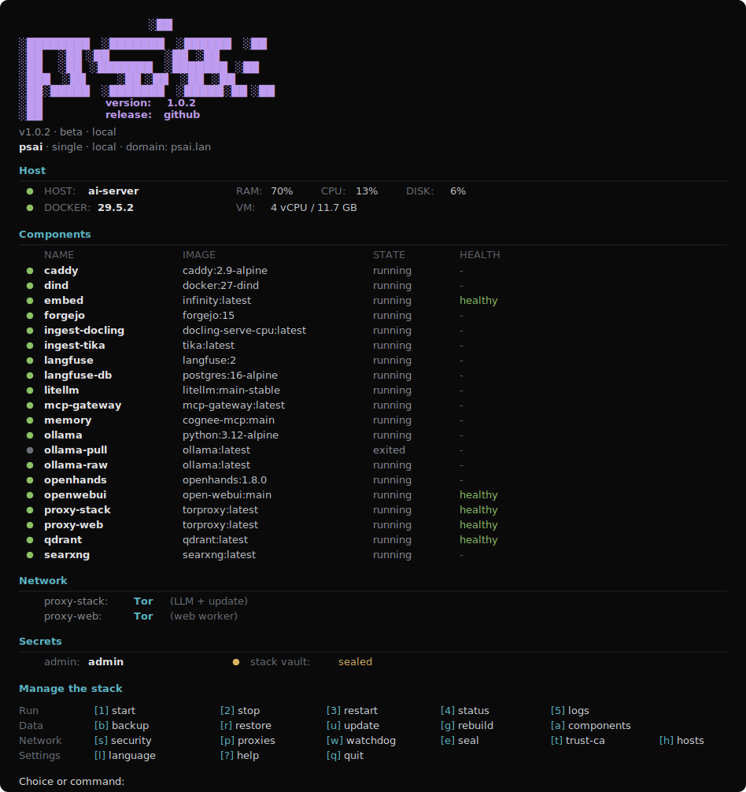

<p align="center">
  
</p>

<h1 align="center">Pandora AI Stack</h1>

<p align="center">
  
  
  
</p>

<p align="center">
  <a href="README.md">English</a> | <b>Русский</b>
</p>

> Стек в разработке

**Self-hosted AI-стек для macOS и Linux: локальная или публичная установка, Docker runtime, локальные модели, агенты, RAG, память, egress-маршрутизация и хранилище секретов.**

<p align="center">
  
</p>

## Компоненты

| Сервис | Роль |
|---|---|
| `openwebui` | Чат: облачные и локальные модели, RAG поверх Qdrant, веб-поиск через SearXNG |
| `openhands` | ИИ-агенты для кода и автоматизации; sandbox-контейнеры опциональны и требуют внимания к безопасности |
| `searxng` | Приватный метапоиск для чата и агентов |
| `forgejo` | Git-сервер |
| `qdrant` | Общая векторная память для чата, RAG и агентов |
| `embed` | RAG-plus embeddings на Linux x64 через Infinity; macOS/Linux ARM по умолчанию используют Ollama embeddings |
| `ingest-docling` / `ingest-tika` | Чтение документов: Docling основной, Tika fallback |
| `mcp` | Встроенный MCP-сервер памяти поверх Qdrant |
| `memory` | Cognee или Graphiti как общая память |
| `ollama` | Локальный OpenAI-compatible LLM endpoint для чата и памяти |
| `mcp-gateway` | Authenticated Docker MCP Gateway с явным allowlist инструментов |
| `mcpo` | MCP-to-OpenAPI bridge для инструментов памяти и gateway в Open WebUI |
| `litellm` | Опциональный OpenAI-compatible gateway для routing, fallback, cache и budgets |
| `langfuse` | Опциональные traces, evals и prompt management |
| `pentest` | Опциональный изолированный PentestGPT только для авторизованного тестирования |
| `caddy` | Reverse proxy и TLS |
| `proxy-stack` | Egress firewall/router для model API, локальных LLM, загрузок и обновлений |
| `proxy-web` | Egress firewall/router для поиска и браузинга агентов |
| `stack-vault` | Хранилище секретов: локальный vault на одном узле, KMS vault в multi-node |

Когда включены `PSAI_MEMORY=cognee|graphiti` или `PSAI_MCP_GATEWAY=true`, `mcpo` регистрирует эти MCP-источники как OpenAPI tool servers в Open WebUI. Чат и агенты используют одну память и один слой инструментов. Gateway-клиенты ходят с Bearer-токенами из `stack-vault`.

## Сценарии Работы

### Single Node


Один хост запускает весь стек. Open WebUI и агенты делят слой инструментов и памяти, Qdrant хранит общее векторное состояние, исходящий трафик идёт через egress-прокси.

### Multi Nodes


Master node управляет изолированными agent worker nodes поверх WireGuard. KMS vault может работать на мастере или отдельной KMS-ноде. Agent workers по умолчанию доступны только внутри WireGuard и могут иметь свои OpenHands, SearXNG и `proxy-web`.

## Быстрый Старт

```bash
bash <(curl -fsSL https://raw.githubusercontent.com/pandora-ai-stack/psai/main/psai.sh)
```

```bash
git clone https://github.com/pandora-ai-stack/psai.git
cd psai && ./psai.sh install
```

## Установка

| Шаг | Описание |
|---|---|
| **0 - Окружение** | Показать статус Docker и пакетов; доставить недостающее. |
| **1 - Узлы** | Выбрать `single` или `multi`. |
| **2 - Профиль** | Выбрать `local` или `public`. |
| **3 - Компоненты** | Включить или отключить опциональные компоненты; ядро включено по умолчанию. |
| **4 - Безопасность** | Выбрать `strict`, `default` или `none`; посмотреть preview и настроить пункты отдельно. |
| **5 - Зона и домены** | Оставить `lan`, изменить домены или пропустить домены на локальной установке. |

После установки запусти `psai`, чтобы открыть дашборд.

## Egress Proxy

Доступны два egress-шлюза:

- `proxy-stack` маршрутизирует model API, локальные LLM, загрузки и обновления.
- `proxy-web` маршрутизирует поиск и браузинг агентов.

Каждый шлюз может работать напрямую, через Tor, WireGuard, VLESS, AdGuard VPN или Tailscale. WireGuard-режим добавляет DNS pinning, kill-switch, опциональные CIDR allow-lists и опциональный FQDN-to-IP allow-list.


## Безопасность

| Возможность | Strict | Default | None |
|---|:--:|:--:|:--:|
| Container hardening (`no-new-privileges`, `cap_drop`) | да | да | да |
| Секреты в `stack-vault` | да | нет | нет |
| TPM auto-unseal на Linux | опц | нет | нет |
| Секреты в plaintext `.env` | нет | да | да |
| CIS sysctls, sshd hardening, auto-upgrades | да | да | нет |
| Файрвол хоста | да | нет | нет |
| Watchdog | да | нет | нет |
| WireGuard-only SSH для multi-node agents | да | нет | нет |
| fail2ban на public installs | да | нет | нет |

OpenHands может использовать Docker socket хоста (`PSAI_OH_MODE=host`). Это контроль уровня хоста, а не сильная песочница. На общих или недоверенных хостах используй `PSAI_OH_MODE=dind`.

Ollama открыт через auth proxy: запрос без `Authorization: Bearer ...` получает `401`, а raw `ollama-raw:11434` остаётся в приватной Docker-сети.

Strict mode хранит runtime-секреты в `stack-vault`. На Linux 5.14+ используется `memfd_secret`; на старых Linux и macOS fallback - locked memory. KMS, fingerprint binding, TPM и secret-memory подробно описаны в [архитектуре](docs/ARCHITECTURE.ru.md).


## Дашборд и Команды

```bash
psai install [--defaults]    start | stop | restart | status | logs [svc]
psai update | rebuild        upgrade            (установка/удаление компонентов)
psai backup | restore        proxy | security   (egress / профиль)
psai seal | unseal           watchdog | trust-ca | add-hosts
psai agents --host IP        uninstall          (данные сохраняются)
psai --lang ru|en            --version | help
```

## Конфигурация

Частые override для неинтерактивной установки:

| Переменная | По умолчанию | Смысл |
|---|---|---|
| `PSAI_NODE_MODE` | `single` | `single` или `multi` |
| `PSAI_DEPLOY` | `local` | `local` или `public` |
| `PSAI_PROFILE` | `default` | `strict`, `default` или `none` |
| `PSAI_NO_DOMAIN` | `false` | только локально: сервисы на localhost-портах без доменов |
| `PSAI_RAG` | `off` | `off`, `basic` или `plus` |
| `PSAI_OLLAMA_MODEL`, `PSAI_OLLAMA_EMBED_MODEL` | platform-aware, `nomic-embed-text` | локальные модели для чата и embeddings |
| `PSAI_OLLAMA_PULL_VIA_PROXY` | `false` | принудительно тянуть Ollama models через `proxy-stack` |
| `PSAI_MCP_GATEWAY` | `false` | включить Docker MCP Gateway и wiring через `mcpo` |
| `PSAI_LLM_GATEWAY` | `false` | включить LiteLLM на `litellm:4000` |
| `PSAI_AGENTS`, `PSAI_OH_MODE` | `true`, `host` | включить agents и выбрать Docker mode: `host`, `rootless` или `dind` |
| `PSAI_EGRESS_STACK`, `PSAI_EGRESS_WEB` | `none` | `tor`, `wireguard`, `vless`, `adguardvpn` или `tailscale` |
| `PSAI_VAULT_PASS` | - | пароль vault для неинтерактивной strict-установки |
| `PSAI_ADMIN_PASSWORD` | - | свой пароль Caddy basic-auth |
| `PSAI_VAULT_TPM` | `false` | запечатать пароль vault в TPM на Linux |
| `PSAI_PTRACE_LOCKDOWN` | `false` | выставить Yama `ptrace_scope=3` до reboot |
| `PSAI_KMS_HOST` | - | WireGuard IP внешней KMS-ноды |
| `PSAI_PROXY_KILLSWITCH`, `PSAI_PROXY_DNS`, `PSAI_PROXY_ALLOW_CIDR`, `PSAI_PROXY_ALLOW_FQDN` | `true`, `1.1.1.1`, -, - | WireGuard firewall controls |

Манифест образов (дефолтные теги, не digest-пины) лежит в `versions.json`. Self-update работает fail-closed: применяет обновление только если signed manifest проходит проверку (SSH-подпись по запиненному ключу) и sha256 установщика совпадает.

## Сборка и Тесты

Установщик (bash):

```bash
./build.sh
shellcheck -S warning psai.sh
bats tests/
```

Хранилище секретов (`stack-vault`, Rust):

```bash
cd vault
cargo build --release
cargo test          # sha256 known-answer + round-trip сериализации blob
cargo clippy --all-targets -- -D warnings
```

## Документация

- [docs/ARCHITECTURE.ru.md](docs/ARCHITECTURE.ru.md) - топология, egress, multi-node, vault

## Лицензия

[MIT](LICENSE) (c) 2026 psai contributors.
